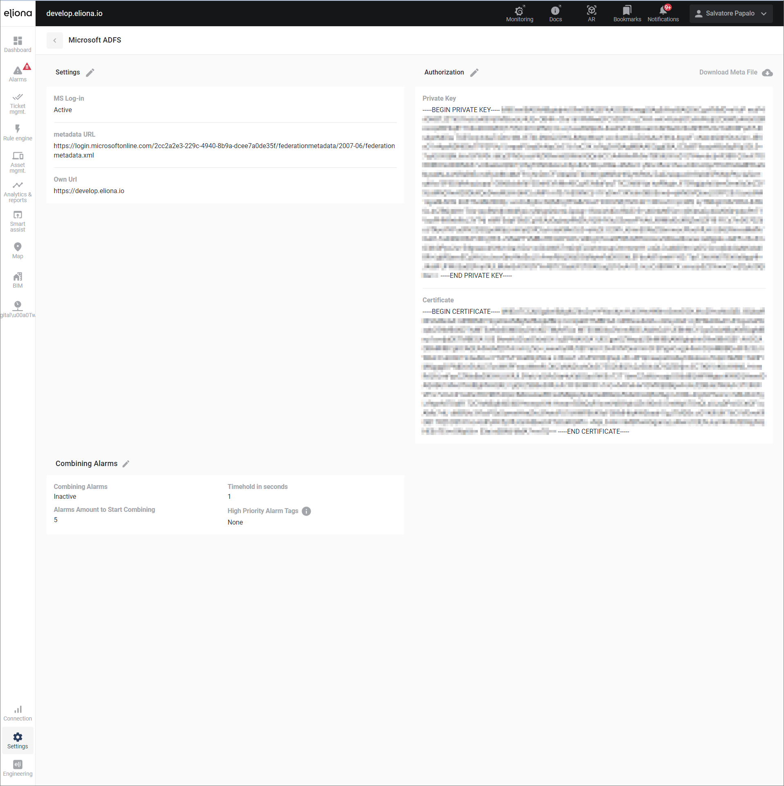
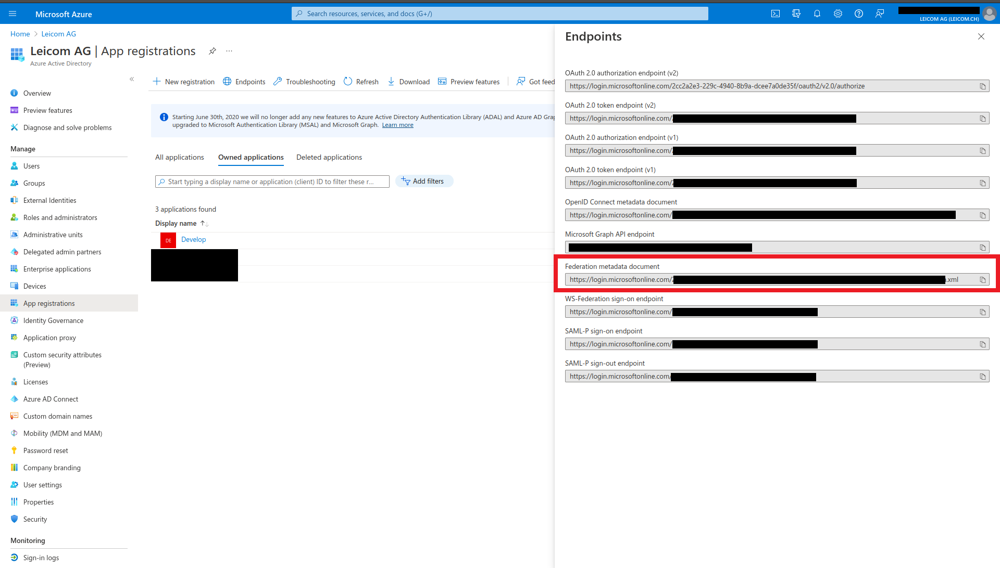
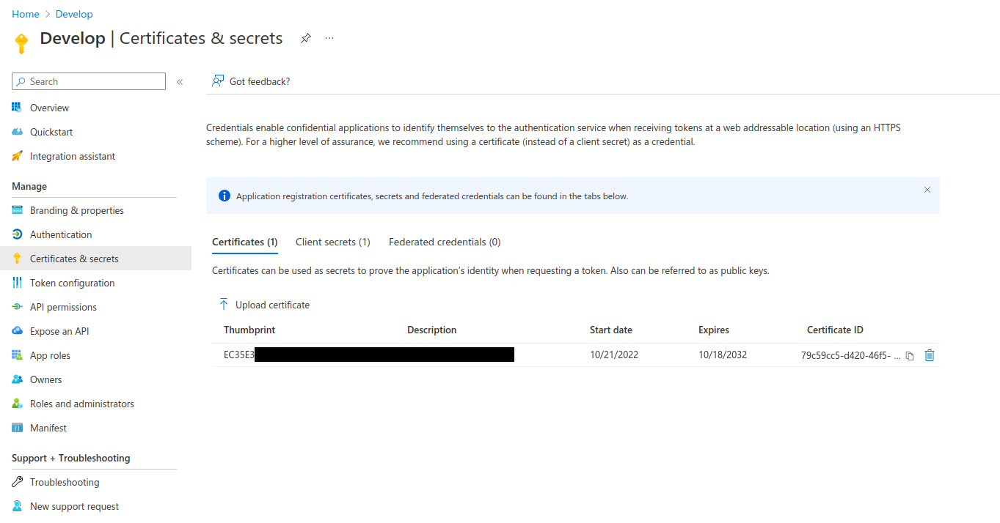

# Microsoft ADFS

The Microsoft ADFS (Active Directory Federation Services) service is a software for logging in to various services using "single sign-on". This means that you have the possibility to log in to Eliona with your Microsoft account or to access Eliona directly after Windows login without entering your credentials.

To integrate Microsoft ADFS as an app in Eliona, you need to register a new app in your Azure account with the URL of your Eliona system. After registering the app, you will receive all the necessary data to configure ADFS in Eliona:

## Configuration

1. **MS Log-in**: Activate the log-in button "via Microsoft" by clicking "Active".
   
2. **Metadata URL**: Enter the Metadata URL from your Microsoft Azure account (found under app registration -> Endpoints).
   
3. **Own URL**: Enter your Eliona system URL (e.g., `https://customer.eliona.cloud`).
4. **Private Key**: Enter the private key in PEM format, matching your Azure certificate (found under Certificates & secrets -> Certificate).
   
5. **Certificate**: Can be a self-generated certificate.
